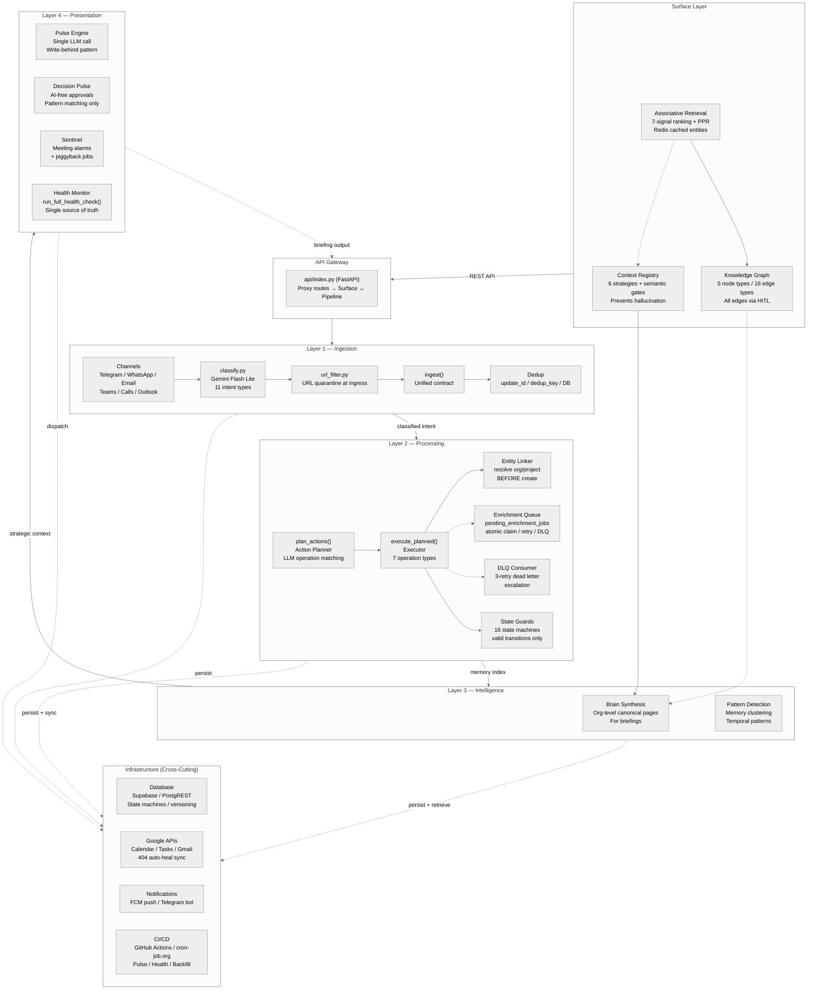

# Rhodey OS — 5-Layer Architecture + Infrastructure



## Key Design Decisions

| Decision | Rationale |
|---|---|
| **Single Action Planner path** | No legacy dispatch / quick_process / staging sorter — one code path for all task/note operations |
| **Enrichment queue (not fire-and-forget)** | `pending_enrichment_jobs` with atomic claim — survives Vercel cold kills |
| **All graph edges through HITL** | `pending_graph_edges` approval table — no silent edge creation |
| **Pulse Engine: single LLM call** | No agent loop, write-behind pattern — eliminates runaway loops |
| **Entity resolution BEFORE creation** | Deterministic linker resolves org/project before DB write, not post-hoc |
| **Formal state machines** | 16 tables with documented valid transitions — guards on all status changes |
| **Surface deprecation path** | Telegram → alert-only. Web UI + Flutter app become full interaction surfaces |

## Architecture Data Flow

```
User (via Telegram / Web UI / Flutter App)
    │
    ▼
┌──────────────────────────────────────────────────────────────────┐
│                       SURFACE LAYER                               │
│  Telegram (deprecating) · Web UI · Flutter App                    │
│  All surface → REST API → api/index.py (FastAPI)                  │
└────────────────────────────────┬─────────────────────────────────┘
                                 │
                                 ▼
┌──────────────────────────────────────────────────────────────────┐
│                         PIPELINE LAYERS                            │
│                                                                   │
│  ┌────────────┐   ┌────────────┐   ┌──────────────┐   ┌────────┐ │
│  │ INGESTION  │──▶│ PROCESSING │──▶│ INTELLIGENCE │──▶│PRESENT │ │
│  │ (Layer 1)  │   │ (Layer 2)  │   │ (Layer 3)    │   │(Layer4)│ │
│  └────────────┘   └────────────┘   └──────────────┘   └────────┘ │
│                                                                   │
└────────────────────────┬─────────────────────────────────────────┘
                         │
                         ▼
              ┌──────────────────────┐
              │    INFRASTRUCTURE    │
              │  DB · Google · Push  │
              │  GitHub Actions      │
              └──────────────────────┘
```

## Purpose of Each Layer

| Layer | What It Does | What It Does NOT Do |
|---|---|---|
| **Surface** | Receives input, renders output. Telegram, Web UI, Flutter App. | Does not process, classify, or persist. Presentation only. |
| **Ingestion** | Classifies intent, quarantines URLs, unifies channels into `ingest()` contract. | Does not execute actions. Does not enrich. |
| **Processing** | Plans actions (LLM), executes operations, enriches asynchronously, compensates on failure. | Does not retrieve historical data. Does not generate briefings. |
| **Intelligence** | Retrieves memories, manages graph, resolves entities, detects patterns, synthesizes brain pages. | Does not create tasks. Does not process raw input. |
| **Presentation** | Generates briefings (LLM), surfaces pending decisions, monitors health, sends alerts. | Does not create tasks. Does not modify data. Read-only output layer. |
| **Infrastructure** | Database, external APIs (Google), push notifications, CI/CD pipelines. Used by ALL 5 layers above. | Does not contain business logic. Not a pipeline stage — it's the foundation everything runs on. |

## File Map

| Layer | Key Files |
|---|---|
| **Surface** | `frontend/` (Next.js), `rhodey_app/` (Flutter), `api/briefing.py`, `api/index.py` (proxy routes) |
| **Ingestion** | `core/webhook/handler.py`, `core/webhook/dispatch.py`, `core/webhook/classify.py`, `core/lib/url_filter.py`, `core/lib/ingest.py`, `core/prompts/classify.py`, `core/skills/whatsapp_ingest.py`, `core/skills/email_ingest.py`, `core/skills/call_ingest.py`, `core/skills/teams_ingest.py` |
| **Processing** | `core/actions/planner.py`, `core/actions/executor.py`, `core/actions/models.py`, `core/pulse/tools.py`, `core/lib/entity_linker.py`, `core/lib/enrichment_queue.py`, `core/lib/state_machines.py`, `core/skills/dlq_consumer.py`, `core/prompts/planner.py` |
| **Intelligence** | `core/retrieval/search.py`, `core/retrieval/ranking.py`, `core/retrieval/ppr.py`, `core/retrieval/extractor.py`, `core/retrieval/pipeline.py`, `core/pulse/memory.py`, `core/pulse/context.py`, `core/pulse/entity_resolver.py`, `core/pulse/graph.py`, `core/lib/graph_rules.py`, `core/context/` (registry), `core/skills/brain_synth_v2.py`, `core/pulse/patterns.py` |
| **Presentation** | `core/pulse/briefing.py`, `core/pulse/decision_pulse.py`, `core/pulse/sentinel.py`, `core/pulse/models.py`, `core/pulse/pipeline.py`, `core/pulse/run_logger.py`, `scripts/run_health.py` |
| **Infrastructure** | `core/services/db.py`, `core/services/google_service.py`, `core/services/push_notification.py`, `api/index.py`, `.github/workflows/` |
|  |  |

> **Note:** The webhook pipeline flow and task lifecycle state machine are documented in separate files: [docs/webhook-pipeline.md](webhook-pipeline.md) and [docs/task-lifecycle.md](task-lifecycle.md).
