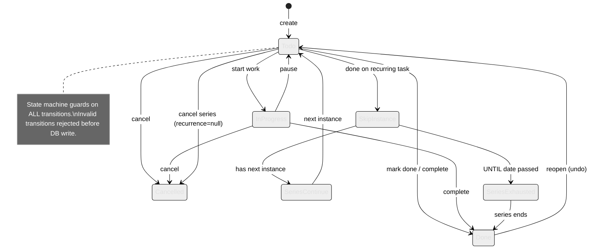

# Rhodey OS — Task Lifecycle

## Transition Rules

| From | To | Guard | Side Effects |
|---|---|---|---|
| `Todo` | `Done` | Valid status change | `completed_at` set. Google Calendar deleted. Tasks synced. |
| `Todo` | `Cancelled` | Valid status change | Recurrence cleared. Calendar deleted. Tasks synced. |
| `Todo` | `SkipInstance` | `recurrence IS NOT NULL` | Instance skipped. Series continues. |
| `SkipInstance` | `SeriesContinue` | Next instance exists | Status=done. Next instance generated. |
| `SkipInstance` | `SeriesExhausted` | UNTIL date < now | Master task closed permanently. |
| `Todo` | `Cancelled` (series) | `recurrence IS NOT NULL` | Series ended. Recurrence=null. |
| `Done` | `Todo` | Was completed <30 min ago | Reopens. Google Tasks→needsAction. |

## File Map

| Component | Key Files |
|---|---|
| Task creation | `core/actions/executor.py`, `core/pulse/tools.py` (`create_task_direct`) |
| Task status changes | `core/pulse/tools.py` (`update_task_status`) |
| State machine guards | `core/lib/state_machines.py` (`guard_require_valid_transition`) |
| Recurring logic | `core/pulse/tools.py` (`skip_recurring_instance`) |
| Google sync | `core/services/google_service.py` (`sync_to_google`, `sync_to_calendar`) |
| Action Planner operations | `core/actions/models.py` (`close_task`, `cancel_recurring`, `modify_recurring`, `suppress_instance`) |
