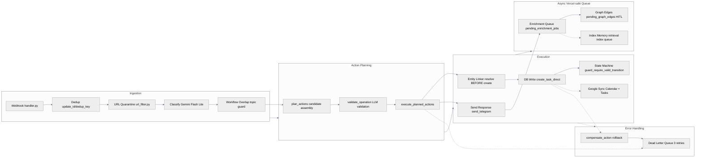

# Rhodey OS — Webhook Message Pipeline

## Key Properties

| Property | Detail |
|---|---|
| **Single routing path** | All paths route through `plan_actions() → execute_planned_actions()` |
| **No legacy pipeline** | `process_single_dump` — fully removed |
| **Queue-based enrichment** | Survives Vercel cold kills (not fire-and-forget) |
| **HITL for graph edges** | All edges go through `pending_graph_edges` approval table |
| **State machine guards** | On ALL status transitions across 16 tables |
| **DLQ with escalation** | 3 retries before escalation |

## File Map

| Stage | Key Files |
|---|---|
| Ingestion | `core/webhook/handler.py`, `core/webhook/dispatch.py`, `core/webhook/classify.py`, `core/prompts/classify.py`, `core/lib/url_filter.py` |
| Action Planning | `core/actions/planner.py`, `core/actions/models.py` |
| Execution | `core/actions/executor.py`, `core/pulse/tools.py`, `core/lib/entity_linker.py`, `core/lib/state_machines.py` |
| Async | `core/lib/enrichment_queue.py`, `core/pulse/graph.py`, `core/retrieval/pipeline.py` |
| Error Handling | `core/skills/dlq_consumer.py`, `core/actions/executor.py` |
